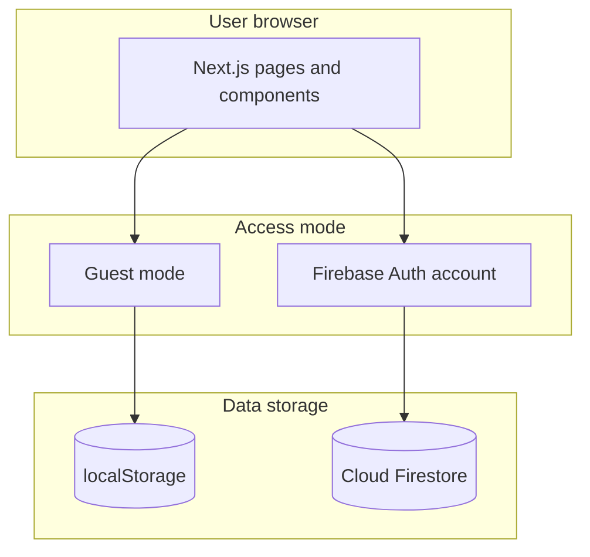

# GoalTracker

**GoalTracker** is a web app that helps people plan their week, track goals, and stay accountable. Users define what they want to achieve, build a realistic timetable (including job or university time), check in each day, and see how well they follow their plan.

This document explains **what the product does** (for HR, stakeholders, or anyone non-technical) and **what technology powers it** (for technical reviewers or developers).

---

## Table of contents

1. [Product overview](#product-overview)
2. [Who it is for](#who-it-is-for)
3. [Product features (full list)](#product-features-full-list)
4. [How users move through the app](#how-users-move-through-the-app)
5. [Guest mode vs signed-in accounts](#guest-mode-vs-signed-in-accounts)
6. [Technology stack](#technology-stack)
7. [Architecture (how it is built)](#architecture-how-it-is-built)
8. [Data & privacy](#data--privacy)
9. [Getting started (developers)](#getting-started-developers)
10. [Deployment](#deployment)
11. [Project structure](#project-structure)

---

## Product overview

Many people struggle to balance goals (learning, fitness, side projects) with fixed commitments (university, work). GoalTracker combines:

- **Goal planning** — what you want to accomplish and how many hours it needs  
- **Weekly scheduling** — when you will work on each goal or block out non-goal time  
- **Daily check-in** — a simple screen each day to mark what you completed  
- **Progress dashboard** — charts and stats showing how often you stuck to the plan  
- **Recovery option (“Superpower”)** — a fair way to count missed goal time as supplementary progress  

The app works in the browser on desktop and mobile. No app store install is required.

**Live project (Firebase):** `goaltracker-500d0`  
**Typical URLs after deploy:** `https://goaltracker-500d0.web.app`

---

## Who it is for

| Audience | How they benefit |
|----------|------------------|
| **Students** | Block uni/job time, schedule study goals (e.g. German, upskilling), check in daily |
| **Working students / professionals** | Separate “Working Student” goals from personal blocks like remote job or commute |
| **Self-learners** | Set target hours per goal and see progress bars and weekly adherence |
| **Anyone trying habit-building** | Timetable + daily check-in creates a clear routine |

---

## Product features (full list)

### 1. Account & access

| Feature | What it does |
|---------|----------------|
| **Email sign-up / sign-in** | Create an account with email and password |
| **Google sign-in** | One-click login with a Google account |
| **Continue as guest** | Use the full app without an account; data stays on that device only |
| **Sign out** | Leave the app; guest or account session ends appropriately |

### 2. Goals

| Feature | What it does |
|---------|----------------|
| **Create goals** | Name, description, and optional emoji (no photo upload needed) |
| **Target hours** | Set total hours needed to complete a goal (e.g. 40 hours for a course) |
| **Progress tracking** | See completed hours vs target and a percentage bar |
| **Edit / delete goals** | Update or remove goals anytime |

**Example goals:** “German B1”, “UP-Skilling”, “Working Student”, “Daily 40 min walk”

### 3. Weekly schedule (timetable)

| Feature | What it does |
|---------|----------------|
| **Manual time slots** | Pick day (Sun–Sat), start/end time, and link to a goal **or** a personal label |
| **Personal blocks (no goal)** | e.g. “Uni/Remote job”, “Part-time work” — no goal required, just a text label |
| **No overlapping times** | System blocks double-booking; one activity per time window |
| **Day picker buttons** | Easy selection of any day including Saturday |
| **Overlap warnings** | Conflicting slots are highlighted in red on the timetable |
| **Auto-fill empty gaps (optional)** | Suggests extra slots from goal target hours only in **free** time — does not stack on existing blocks |
| **Replace entire schedule (optional)** | Regenerates the week from goals with confirmation (replaces manual entries) |

### 4. Today (daily check-in)

| Feature | What it does |
|---------|----------------|
| **Today’s landing screen** | After login, users see what is scheduled **today** |
| **Mark as done** | Confirm completion for each block when appropriate |
| **Time rule** | Goal slots can only be marked done **after the slot ends + 1 minute** (prevents cheating future slots) |
| **Missed detection** | Past goal slots not completed are marked “Missed” automatically |
| **Personal blocks** | Can be marked done; they do not affect goal hour progress |

### 5. Dashboard (analytics)

| Feature | What it does |
|---------|----------------|
| **Plan adherence %** | Overall score for how often the user followed the plan |
| **14-day bar chart** | Completed vs missed vs “Superpower” per day |
| **Summary cards** | Active goals, missed count, superpowers used |
| **Missed goals list** | Past items that were not completed on time |

### 6. Superpower (recovery)

| Feature | What it does |
|---------|----------------|
| **One-tap recovery** | For **missed goal** slots only, user can mark work as done in “supplementary” time |
| **Progress still counts** | Recovered time adds to the goal’s completed hours |
| **Fair use** | Only for real goals, not personal blocks; only after a slot was missed |

### 7. Delete records (data control)

| Feature | What it does |
|---------|----------------|
| **Delete schedule & check-ins** | Removes all timetable slots and daily completion history |
| **Delete all goals** | Removes every goal |
| **Delete all data** | Full reset — goals, schedule, and check-ins |

Available on **Schedule** and **Goals** pages. Guest users clear browser storage; signed-in users clear Firebase data.

---

## How users move through the app

```text
Login / Guest
      ↓
   Today (daily check-in)  ← default home
      ↓
┌─────┴─────┬─────────────┬──────────┐
│  Goals    │  Schedule   │ Dashboard │
│  (define) │  (timetable)│ (stats)   │
└───────────┴─────────────┴──────────┘
```

**Typical first-time setup**

1. Sign in or continue as guest  
2. **Goals** — add goals with emojis and target hours  
3. **Schedule** — add real weekly blocks (German class, uni job, upskilling, walk, etc.)  
4. Each day open **Today** and mark items done after their time ends  
5. **Dashboard** — review adherence and use Superpower on missed goals if needed  

---

## Guest mode vs signed-in accounts

| | **Guest** | **Signed-in user** |
|---|-----------|-------------------|
| **Storage** | Browser local storage (this device only) | Google Firebase cloud database |
| **Account** | None | Email or Google |
| **Sync** | No — clearing browser data loses progress | Yes — same account on any device |
| **Features** | Same UI and features | Same UI and features |
| **Best for** | Trying the app, private/local use | Long-term tracking, backup, multi-device |

Guest and account data are **separate**; signing up does not automatically import guest data.

---

## Technology stack

Written for HR or non-engineering readers: each item is **what it is** and **why we use it**.

### Frontend (what users see and click)

| Technology | Role in plain language |
|------------|------------------------|
| **Next.js 16** | Modern web framework: fast pages, good SEO, production-ready structure |
| **React 19** | Industry-standard UI library for interactive screens |
| **TypeScript** | Typed code — fewer bugs, easier maintenance and handover to other developers |
| **Tailwind CSS 4** | Utility styling for a clean, responsive layout (phone + desktop) |
| **Lucide React** | Consistent icons (calendar, goals, dashboard, etc.) |
| **Recharts** | Dashboard charts (adherence over 14 days) |
| **date-fns** | Reliable date/time formatting and calculations |

### Backend & cloud (signed-in users)

| Technology | Role in plain language |
|------------|------------------------|
| **Firebase Authentication** | Secure login (email/password + Google) |
| **Cloud Firestore** | NoSQL database for goals, schedule, and check-in records per user |
| **Firebase Hosting** | Hosts the built website on Google’s CDN (HTTPS, global) |
| **Firestore Security Rules** | Ensures users can only read/write **their own** data |

### Local storage (guest users)

| Technology | Role in plain language |
|------------|------------------------|
| **Browser localStorage** | JSON database on the device for guest goals, schedule, and completions |

### Tooling & quality

| Technology | Role in plain language |
|------------|------------------------|
| **ESLint** | Code quality checks |
| **npm** | Package and dependency management |
| **Firebase CLI** | Deploy hosting, database rules, and indexes |

### Design principles in code

| Principle | Benefit |
|-----------|---------|
| **One component per file** | Easier to read, review, and onboard new developers |
| **Repositories + services** | Clear split: data access vs business rules (schedule overlap, time gates, Superpower) |
| **Unified data layer** | Same features for guest (local) and user (Firebase) without duplicating screens |

---

## Architecture (how it is built)

### High-level diagram



### Main app sections (routes)

| Page | Path | Purpose |
|------|------|---------|
| Home redirect | `/` | Sends user to Today or Login |
| Login | `/login` | Sign in, Google, or guest |
| Sign up | `/signup` | New account or guest |
| Today | `/today` | Daily check-in |
| Dashboard | `/dashboard` | Charts and missed goals |
| Goals | `/goals` | Manage goals |
| Schedule | `/schedule` | Weekly timetable |

### Data stored per user

```text
Goals        → name, description, emoji, target hours, completed hours
Schedule     → day, start/end time, goal OR personal label
Completions  → daily status: completed / missed / supplementary
```

### Important business rules (product logic)

1. **No schedule overlaps** — one activity per time slot per day  
2. **Completion time gate** — cannot mark a goal done before slot end + 1 minute  
3. **Superpower** — only for missed **goal-linked** slots; updates progress  
4. **Auto-fill** — only places new slots in **empty** gaps, respects existing timetable  

---

## Data & privacy

- **Signed-in users:** Data is stored under their Firebase user ID. Security rules block access by other users.  
- **Guests:** Data never leaves the device unless the user later creates an account (guest data is not auto-uploaded).  
- **No Firebase Storage** for images — goals use emojis only (no paid file storage).  
- **API keys** in the client are standard for Firebase web apps; production should use Firebase Console restrictions and authorized domains.  

---

## Getting started (developers)

### Prerequisites

- Node.js 18+ (20+ recommended)  
- npm  
- Firebase project ([Firebase Console](https://console.firebase.google.com/project/goaltracker-500d0))  

### Install and run locally

```bash
npm install
cp .env.local.example .env.local
# Fill NEXT_PUBLIC_FIREBASE_* values from Firebase Console
npm run dev
```

Open **http://localhost:3000**

### Useful commands

| Command | Description |
|---------|-------------|
| `npm run dev` | Local development server |
| `npm run build` | Production build (static export to `out/`) |
| `npm run deploy:hosting` | Build and deploy to Firebase Hosting |
| `npm run deploy:rules` | Deploy Firestore security rules and indexes |
| `npm run deploy` | Deploy hosting + Firestore config |

### Firebase setup (first time)

1. Enable **Authentication** → Email/Password and **Google**  
2. Create **Firestore** database  
3. Deploy rules: `npm run deploy:rules`  
4. Add `localhost` and your hosting domain to **Authorized domains**  

See [CHANGELOG.md](./CHANGELOG.md) for version history.

---

## Deployment

The app is deployed as a **static site** on **Firebase Hosting** (same Firebase project as Auth and Firestore).

```bash
npm run deploy:hosting
```

Live URLs (example):

- https://goaltracker-500d0.web.app  
- https://goaltracker-500d0.firebaseapp.com  

`NEXT_PUBLIC_*` environment variables must be set **before** `npm run build` (they are embedded at build time).

---

## Project structure

```text
src/
├── app/                    # Pages (login, today, goals, schedule, dashboard)
├── components/             # UI (one component per file)
│   ├── auth/               # Login, signup, guest
│   ├── goals/              # Goal forms and lists
│   ├── schedule/           # Timetable builder
│   ├── today/              # Daily check-in
│   ├── dashboard/          # Charts and Superpower
│   └── data/               # Delete records panel
├── contexts/               # Auth state (guest vs user)
├── services/               # Business logic + data access router
├── repositories/           # Firebase data access
│   └── guest/              # localStorage data access
├── lib/                    # Firebase config, time/schedule utilities
└── types/                  # TypeScript models

firestore.rules             # Database security
firestore.indexes.json      # Query indexes
firebase.json               # Hosting + Firestore deploy config
```
## Demo Video

Watch the GoalTracker walkthrough/demo here:

[](https://youtu.be/qaBJgLVpS6s)

Direct link: https://youtu.be/qaBJgLVpS6s

